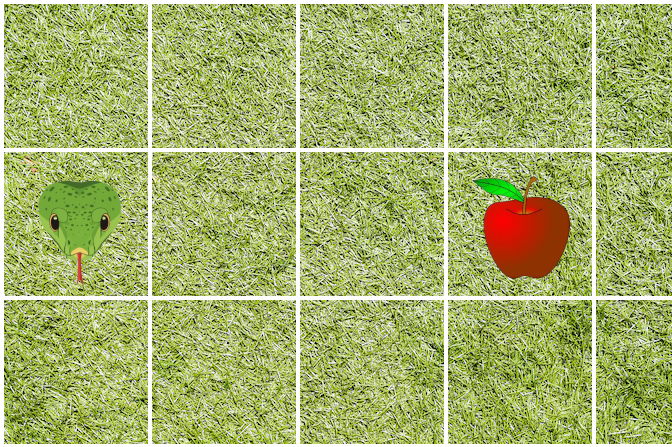
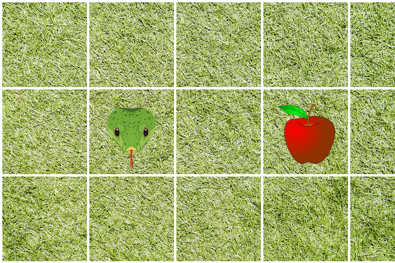
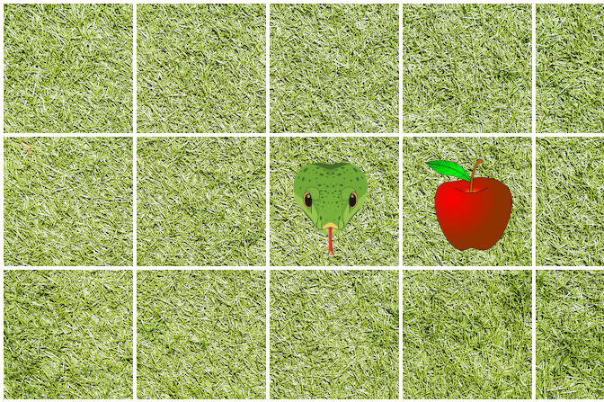
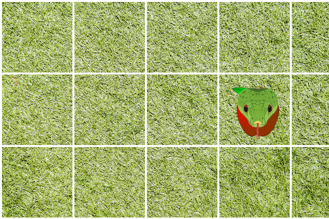
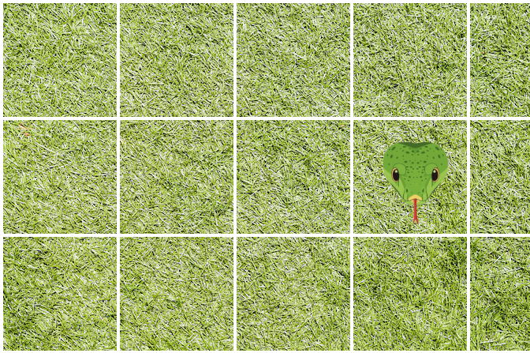

# ESTRUTURAS DE REPETIÇÃO
Imagine o seguinte programa: temos uma cobrinha que quer ir pegar uma maçã! Olhando para imagem abaixo, observamos que a cobrinha precisa andar 3 blocos para o lado para chegar à fruta e depois come-lá:
\

\
Até onde aprendemos, para fazer essa cobra chegar na maçã e come-lá, temos que indicar cada paso individualmente:
\
**Passo 1**
\
`INSTRUÇÃO: Ande para Direita`
\

\
**Passo 2**
\
`INSTRUÇÃO: Ande para Direita`
\

\
**Passo 3**
\
`INSTRUÇÃO: Ande para Direita`
\

\
**Passo 4**
\
`INSTRUÇÃO: Come a maçã`
\

\
**Passo 5**
\
`INSTRUÇÃO: Fim do programa`
\
Em resumo, o código ficaria assim:
```
INÍCIO DO PROGRAMA
    ANDE PARA DIREITA
    ANDE PARA DIREITA
    ANDE PARA DIREITA
    COME A MAÇÃ
FIM DO PROGRAMA
```

Mas e se a maça não tivesse na coluna 4? E se ela tivesse na coluna 5, na 6, na 8, na 1000!!! Imagina você copiar e colar o mesmo código mil vezes!
\
Então, como resolvemos esse problema? Isso é simples, com estruturas de repetição (ou **laços de repetição**)! Com elas, podemos indicar para repetir um código até uma condição ser cumprida. Vejamos o pseudo-código abaixo:
```
INÍCIO DO PROGRAMA
    ENQUANTO a maçã não encontrada FAÇA
        ANDE PARA A DIREITA
    FIM DA REPETIÇÃO
    COME A MAÇÃ
FIM DO PROGRAMA
```

Esse código vai funcionar para qualquer distância entre a maçã e a cobrinha.
\
Agora vamos ver as estruturas de repetição que o Python nos oferece!

## FOR
A estrutura `for` percorre uma lista de elementos. Não precisa saber de listas por enquanto, quando falarmos delas, abordaremos melhor esta estrutura de controle.
\
Para usarmos o `for` como um laço de repetição geral, iremos usar o método `range()`. Como ele, podemos fazer a seguintes ações como `for`:

### Ir de x até y de 1 em 1, dado x menor que y
```python
x = 0
y = 10

for valor in range(x, y):
    print(f"{valor} ->", end=" ")
print("Fim")
```
\
O resultado será:
\
`0 -> 1 -> 2 -> 3 -> 4 -> 5 -> 6 -> 7 -> 8 -> 9 -> Fim`


Ou seja, o laço vai executar de 0 a 10, mas vai ignorar o 10. Isso tem uma explicação que vai ser esclarecido na aula de lista, mas tenha isso em mente **em uma contagem de x a y, é contado até o y-1 e o y é ignorado**

### Ir de x até y de z em z, dado o x menor que y
```python
x = 0
y = 10
z = 2

for valor in range(x, y, z):
    print(f"{valor} ->", end=" ")
print("Fim")
```

O resultado fircará:
\
`0 -> 2 -> 4 -> 6 -> 8 -> Fim`


Desde que o 10 é ignorado, então vai contar de 2 em 2, até o 8 e imprimir depois o `"Fim"`. Se então trocassemos o y por 11, ao invés de 10, aí teríamos o 10 em nossa contagem. Faz seus testes.

### Ir de y até x de -1 em -1, dado o x menor que y
Tá, mas é possível fazer o camimho contrário: ir de 10 até 0? A resposta é sim! Trocando o `x` e `y` de lugar no `range()` e adicionando no lugar do `z` o `-1`, é possível contar na ordem oposta:
```python
x = 0
y = 10

for valor in range(y, x, -1):
    print(f"{valor} ->", end=" ")
print("Fim")
```

O resultado seria:
\
`10 -> 9 -> 8 -> 7 -> 6 -> 5 -> 4 -> 3 -> 2 -> 1 -> Fim`


Do mesmo jeito que contar de 0 à 10, contar de 10 à 0, o contador vai iniciar em 10 e ir até um 1 finalizar, ignorando o 0.

### Ir de y até x de z em z, dado o x menor que y e z menor que zero (0)
Aplicando a mesma lógica para a contagem em ordem crescente, na lógica decrescente é possível fazer a mesma coisa:
```python
x = 0
y = 10
z = -2

for valor in range(y, x, z):
    print(f"{valor} ->", end=" ")
print("Fim")
```

O resultado será:
\
`10 -> 8 -> 6 -> 4 -> 2 -> Fim`


Aqui, inicia-se em 10 e vai até 2, ignorando o último número da contagem: o zero (0). Para ele aparecer, o `x` tem que ser menor que o próprio zero.

### FOR + ELSE
Outra coisa que o `for` permite é usar o `else` junto dele. O `else` executará logo depois do laço terminar.
```python
for valor in range(0,10):
    print(f"{valor} ->", end=" ")
else:
    print("Fim do laço")
```

## WHILE
O `while` acaba sendo mais simples que o `for`, ele pega uma condição e enquanto ela for cumprida, o laço executa. Para isso, tem que ter um controlador do laço, aquele que vai indicar seu fim, normalmente um contador. Abaixo um exemplo:
```python
contador = 0
while contador < 10:
    print(f"{contador} -> ", end=" ")
    contador += 1
else:
    print("Fim do laço")
```

Aqui, vamos ter um contador que vai de 0 até 9, em que se ignora o 10. Assim como o `for`, com o `while` é possível usar o `else`.
\
Toda vez que o laço executa, o contador é incrementado mais 1. Caso essa linha seja apagada, o laço executa o código de maneira infita! Então certifique-se se há uma maneira de sair do laço para não entrar num loop infinito.
\
Outro ponto a se destaca é a condição: `contador < 10`. O laço vai de 0 a 9 por conta de realmente incluir o 10! Quando o contador chega no dez, a condição para de ser cumprida e então o programa sai do laço.

## Auxiliares
Junto dos laços, é possível usar auxiliares para determinadas tarefas. Abaixo está listado cada um deles:

<table>
    <thead>
        <tr>
            <th>AUXILIAR</th>
            <th>DESCRIÇÃO</th>
        </tr>
    </thead>
    <tbody>
        <tr>
            <th>break</th>
            <td>Ele interrompe a execução do laço e sai dele</td>
        </tr>
        <tr>
            <th>continue</th>
            <td>Ele interrompe a execução do laço e retorna para o começo dele para outra iteração</td>
        </tr>
        <tr>
            <th>pass</th>
            <td>Não executa nada, apenas usado para não deixar o laço vazio (sem nenhum código)</td>
        </tr>
    </tbody>
    
</table>

Olhe os exemplos abaixo:
\
**Break**
```python
num = 0
while num < 5:
    num += 1

    if num == 3:
        break

    print(num, end=" ")
```

Resultado:


`1 2`


O `break` interrompeu o laço quando o `num` ficou igual a 3.


**Continue**


```python
for num in range(5):
    if num == 3:
        print("Encontrei o 3")
        # Executa o continue, pulando para o próximo laço
        continue
    else:
        print(num)

    print("Estou abaixo do IF")
```

Resultado:
```
0
Estou abaixo do IF
1
Estou abaixo do IF
2
Estou abaixo do IF
Encontrei o 3
4
Estou abaixo do IF
```

Quando o código encontrou o 3, ele entrou no `if`, imprimiu a mensagem e "voltou para o topo" do laço, ignorando o `print` no final.


**Pass**


```python
# por padrão, se especificar só um elemento, o range inicia em 0
for contador in range(10):
    pass
```

O `pass` apenas não deixará o for vazio, permitindo espaço para futuras implementações.

## Conclusão
UFA! Outra aula gigantesca. Abordamos muita coisa sobre os laços hoje! Próxima aula entenderemos de fez sobre as listas! Tópico muito importante para a programação no geral, e um dos motivos é sua relação íntima com os textos - as chamadas Strings!