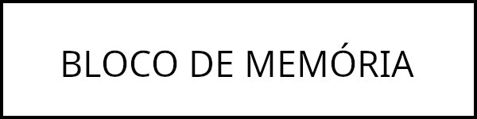
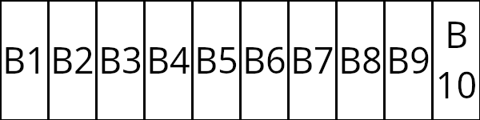
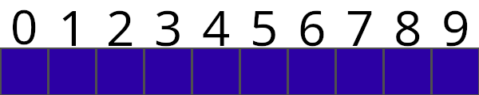

# ESTRUTURA LISTA
Sabe a sua lista de compras, sua lista de amigos, lista de seguidores no TikTok (o famoso TikoTeko) etc. etc. Sabe o eles tem em comum? SÃO TUDO LISTAS!


Para nós, meros humanos, uma lista é algo simples, e de vez em quando bobo. Mas para um computador é algo de fritar os neurônios ~~(ou o processador hahaha)~~. Ele entende blocos isolados, um número que representa uma idade, uma letra que represanta um lugar no estacionamento, um decimal que representa um peso... Tudo isso, o computador pode armazenar em 0's e 1's sem tanta dificuldades. Mas lista são sequências de valores que estão ligadas por algo - para nós, o sentido. 


Quando você faz uma lista de compras, elas se relacionam com as coisas que tu precisas comprar; sua *wishlist* da Steam é de jogos que queres comprar; uma lista de pacientes de transplante, em que as pessoas são relacionadas com aquelas que precisam do transplante; e por assim vai. 


Mas a máquina não entende esse contexto. Não dá para informar para ela que você quer criar uma lista com tais valores e eles estão tudo relacionado por tal coisa!


Então como a máquina faz?? Bem, vamos entender o básico de uma lista em um computador.


Penso em um retângulo gigantesco! (Ou só olhe a imagem abaixo):





Este vai ser nosso bloco de memória que iremos usar para montar nossa lista!


Não dá só jogar as informações aí dentro, nesse estado ele só recebe uma informação. Então vamos dividir ele! Abaixo há uma imagem do bloco de memória divido em blocos menores, cada um iniciando com B, em seguida um número para representar sua posição





Agora temos dez espaços de memórias que conseguimos jogado até dez informações aí dentro! Podemos colocar uma informação em B1, outra em B2, e assim por diante! Mas, mesmo assim, não temos uma lista real. O que temos agora é vários blocos com informações, mas nenhum deles estão ligados entre si.


Então o próximo passo que o computador faz é armazenar em cada bloco o endereço do próximo da lista. Assim, o B1 tem o endereço do B2, o B2 tem o endereço do B3, e assim continua até B10, que não tem um próximo elemento.


Praticamente assim que funciona uma lista em um computador. Uma variável nunca vai receber essa lista toda, ela só vai receber o endereço do primeiro elemento que, a partir daí, vai estar ligado com os outros elementos.


Agora vamos ilustrar uma lista (ou como é chamado em alguns lugares de vetor ou *array*) como mais ou menos seria em uma linguagem de programação! Olhe a imagem abaixo:





Parecido com o bloco de memória, não? Agora temos um espaço na memória que é dividido em 10 (dez) partes. O que você vê acima desse retângulo é os índices de cada bloco de memória, ou seja, seu "endereço" para nós. Na grande maioria das linguagens, o índice de uma lista inícia em 0. Então, uma lista de 10 elementos, o índice vai de 0 a 9.


Em linguagens de mais baixo nível, como C e Rust, um vetor não pode ter elementos de diferentes tipos, ou seja, o bloco de memória reservado para um array deve conter apenas um tipo: como uma lista de inteiro, de caracteres etc.


Em Python é possível fazer um array que pode ter diferentes tipos em uma lista.


Também em diversas outras linguagens de programação, é possível acessar um elemento de uma lista indicando seu índice. Por exemplo, temos uma lista `nomes` em que os elementos são: "Luana", "Philip", "Filipi" e "Daniel", respectivamente. Para acessar o elemento na primeira posição escreva-se `nomes[0]`, ou seja, acessar o elemento no índice 0. Agora para acessar o Filipi, acessamos o índice 2 (`nomes[2]`).


Além disso, no mesmo molde em acessar um valor, é possível modificar o valor de uma lista acessando um índice


Agora vamos ver os tipos de lista em que se tem em Python.


## Tuplas
Tuplas são listas de valores que são fixas, ou seja, você cria uma lista e ela não pode ser modificada durante o resto do código. Antigamente, a função `range()` retornava uma tupla, todavia agora ele só retorna um item iterável.


Para declarar uma tupla, declara-se uma variável com atribuição de parênteses (`()`) com valores dentros, como o exemplo abaixo:

```python
tupla = (10,20,30,40)
```

## Listas/Array
Lista, ou Array, são realmente a lista que conhecemos. Uma lista pode ser atualizada, adicionando e/ou removendo valores.


Para declarar uma lista, usa-se colchetes (`[]`).

```python
lista = [10,20,30,40]
```

As listas em Python acabam por ter operações de segmentação, métodos e funções que podem facilitar certas operações.

### Segmentação
A segmentação é o processo de pegar partes de uma lista. A própria ação de acessar um índice no array é uma segmentação. Podemos ter alguns processos de segmentação:

#### Segmentação de um índice x para um índice y
```python
lista = [10, 20, 30, 40, 50]

x = 1
y = 3

print(lista[x:y]) # [20,30]
```

O `print` mostrará uma lista dos elementos do índice 1 até o 2, ignorando o de índice 3.

#### Segmentação de um índice x para um índice y, de z em z
```python
lista = [10, 20, 30, 40, 50, 60, 70, 80, 90, 100]

x = 1
y = 9
z = 2

print(lista[x:y:z]) # [20, 40, 60, 80]
```

Neste caso, ele vai printar todos os elementos do índice 1 até o 8, pulando de 2 em 2.

#### Segmentação de um índice 0 para um índice y, de z em z
```python
lista = [10, 20, 30, 40, 50, 60, 70, 80, 90, 100]

y = 9
z = 2

print(lista[0:y:z]) # [10, 30, 50, 70, 90]
# OU
print(lista[:y:z]) # [10, 30, 50, 70, 90]
```

Aqui, o `print` é do começo da lista até o 8, de 2 em 2.


#### Segmentação de um índice x para um índice até o final, de z em z
```python
lista = [10, 20, 30, 40, 50, 60, 70, 80, 90, 100]

x = 3
z = 1

print(lista[x::z]) # [40, 50, 60, 70, 80, 90, 100]
# OU
print(lista[x:len(lista):z]) # [40, 50, 60, 70, 80, 90, 100]
```

Diferente do caso anterior, o `print` inicia no 3 e vai até o final da lista, de 1 em 1. O `len()` é uma função que devolve o tamanho de uma lista.


#### Segmentação do começo até final do array, de 1 em 1
```python
lista = [10, 20, 30, 40, 50, 60, 70, 80, 90, 100]

print(lista[::1]) # [10, 20, 30, 40, 50, 60, 70, 80, 90, 100]
# OU
print(lista[:]) # [10, 20, 30, 40, 50, 60, 70, 80, 90, 100]
```

Aqui será imprimido todos os valores do array.

#### Acesso à valores com índices negativos
Outra coisa que o Python oferece é acessar os valores por índices negativos. Com os índices negativos, é possível acessar o último índice com `-1`, e o primeiro índice com `-len(lista)`.

```python
lista = ["Janeiro", "Fevereiro", "Março", "Abril", "Outros Meses"]

print(lista[-1]) # Outros Meses
print(lista[-len(lista)])
print(lista[-3]) # Março
```


### Métodos das listas
Os métodos das listas permite fazer operações nas listas, desde de inserção até sua cópia. Vamos abordar alguns principais.

#### list.copy()
Como dito acima, quando declaramos `lista = [10,20,30,40,50]`, a `lista` não recebe o conteúdo, mas o endereço para o primeiro elemento. Então fazer a seguinte operação:
```python
lista = [10,20,30,40,50]
lista_copy = lista
```

Na realidade, o `lista_copy` recebe o endereço da lista. Então, toda a operação da `lista_copy` afeta o que está na `lista`.


Para realmente se fazer uma códia do array, há duas maneira:
```python
lista = [10,20,30,40,50]

# 1° Forma: Segmentação
lista_copy1 = lista[:]

# 2° Forma: o método .copy()
lista_copy2 = lista.copy()
```

#### list.append(value, ...)
O `.append()` adiciona elementos no final da lista.
```python
lista = [10,20,30,40,50]

lista.append(60)
lista.append(70,80,90)
```

#### list.insert(index, value)
O `.insert()` adiciona um valor em um posição (indíce) específico.
```python
lista = [10,20,30,40,50]

lista.insert(0,60)
lista.insert(1,"Textos")

print(lista) # [60,"Textos",10,20,30,40,50]
```

#### list.pop(index)
O `.pop()` remove um elemento específicado pelo index e devolve o valor excluído. Caso o método não receber argumento, ele remove o último elemento do vetor.
```python
lista = [10,20,30,40,50]

valor1 = lista.pop() # 50
valor2 = lista.pop(2) # 30
# valor3 = lista.pop(3) -> resulta em erro, pois o elemento naquela posição já foi excluído

print(lista) # [10,20,30]
print(valor1) # 50
print(valor2) # 30
```

#### list.clear()
O `.clear()` apaga todos os elementos de uma lista.
```python
lista = [10,20,30,40,50]

lista.clear()

print(lista) # None (que indica vazio em Python)
```

#### list.remove(value)
O `.remove()` ele remove um elemento da lista, especifícado pelo valor. Se o elemento não for encontrado, será acionado um erro na execução. O primeiro elemento da ocorrência é removido, se tiver mais de dois deles, só um será removido.

```python
lista = [10,20,"Texto",30,"Texto",40,50]

lista.remove("Texto")

print(lista) # [10,20, 30,"Texto",40,50]

lista.remove("Texto")

print(lista) # [10,20, 30, 40,50]
```

#### list.index(value [, start [, stop]])
O `.index()` ele devolve para nós um índice da primeira ocorrência do `value`. O `start` e o `stop` significam, respectivamente, o início da busca e em qual índice ela para.


Caso o `.index()` não encontre o valor passado, ele retorna um erro de valor não encontrado.
```python
lista = [10, 20, 30, 40, 50, 60, 70, 80, 90, 100]

# print(lista.index(value [, start [, stop]]))
print(lista.index(20)) # 1
print(lista.index(50, 2)) # 4
print(lista.index(20, 2)) # ValueError, ou seja, o valor não foi encontrado
print(lista.index(70, 2, 8)) # 6
print(lista.index(70, 2, 5)) # ValueError, ou seja, o valor não foi encontrado
```

#### list.count(value)
O método `.count()` contabiliza quantos daquele valor aparece na lista.
```python
lista = [10, 20, 30, 40, 50, 60, 20, 80, 90, 20]

print(lista.count(20)) # 3
```

#### list.reverse()
Este método inverte a posição dos valores no vetor. Este método modifica a lista original.

```python
lista = [1, 2, 3, 4]

lista.reverse()

print(lista) # [4,3,2,1]
```

#### list.sort()
O `.sort()` acaba por order a lista. Caso de número, do maior para o menor, em caso de textos, em ordem alfabética.

```python
lista = [10, 20, 60, 40, 50, 60, 30, 80, 10, 100]

lista.sort()

print(lista) #[10, 10, 20, 30, 40, 50, 60, 60, 80, 100]
```


### Funções para listas
As função em listas não vão modificar seus valores internos, mas acabam por retornar resultados baseados neles. Abaixo estão as principais:

#### sum(list)
Está função fica responsável por retornar a soma dos valores de uma lista

```python
numeros = [1, 3, 6]

print(sum(numeros)) # 10
```

#### len(list)
O `len()` devolve o tamanho de uma coleção.
```python
colecao = ["Nome", 1, "Vinte"]

print(len(colecao)) # 3
```

#### max() e min()
Essas duas funções fica responsáveis por retornar para nós os valores máximos e os valores mínimos das listas. Esses valores podem variar: se for número, vai pegar o maior ou o menor dele; se for uma palavra, será baseado na ordem alfabética.

```python
numeros = [15, 5, 0, 20, 10]
nomes = ['Caio', 'Alex', 'Renata', 'Patrícia', 'Bruno']

print(min(numeros)) # 0
print(max(numeros)) # 20
print(min(nomes)) # Alex
print(max(nomes)) # Renata
```

## Dicionário
O dicionários em Pythons seriam equivalentes à `Struct` em C e `Object` em JavaScript, ou até mesmo o `JSON`. Ele relaciona nomes com valores.

Para declarar um dicionário, usa-se chaves (`{}`).

```python
dicionario = {
    "Nome": "Philip",
    "Idade": "65"
}
```

Diferente das listas mais comuns, para acessar um elemento do dicionário é através do "nome". Veja o exemplo abaixo:

```python
dicionario = {
    "Nome": "Philip",
    "Idade": "65"
}

print(dicionario["Nome"]) # "Philip"
```

## String
Strings? STRINGS! Ou textos, em nosso velho português. Sim, String é uma coleção, mais precisamente uma coleção de caracteres!


Seu computador não entende textos em si, somente caracteres. O que acontece é que o computador junta tudo em uma coleção e interpreta a lista como um texto.


Todas as funções e métodos de listas é aplicável em Strings, além das técnicas de segmentação.


## OBSERVAÇÕES IMPORTANTES: Custos
Aqui que começaremos a entrar numa parte importante da programaçã, mas não aprofundaremos muito: **o custo de um programa**. 


Toda vez que você está desenvolvendo algum programa, não é só ir para o método mais simples e fácil. Primeiro, tem que se analisar o contexto que aquele programa vai se aplicar e entender se a entrega rápida é mais importante que o custo operacional do código.


"Tá tá, já entendi! Mas onde você quer chegar?". Bem, o computador tem um grande impecílio: ele não sabe extender ou diminuir um expaço de memória. Caso você tenha criado um vetor para comportar 10 números, ele só vai comportar 10 números! "Mas, se ele tem um tamanho fixo, por que posso colocar elementos infinitamente num array?". Bem, agora entramos na principal diferença entre as linguagens de mais baixo nível e as linguagens de mais alto nível!


Se pegarmos a linguagem C, se criamos um vetor de 10 espaços, para colocar um décimo primeiro elemento nele, na realidade precisamos criar um novo vetor com 11 espaços e copiar todos os outros 10 elementos para o novo e aí depois colocar o 11° elemento na nova lista (além de ter que liberar a memória da antiga lista). 


Isso trás pouco dinamismo na hora de desenvolver um programa tendo que se preocupar com esse mínimos detalhes. Porém, linguagens de mais alto nível eles já abstraem todo esse processo dos nossos olhos, nos permitindo criarmos arrays que magicamente só precisamos colocar elementos dentro dele e o espaço já é alocado sem que precisamos fazer todo o processo acima! Isso que o Python faz, todo esse processo nas surdinas.

"Tá, mas por que preciso saber disso?!". Bem, imagina num programa que a sua lista está toda hora mundando de tamanho, ou seja, faz esse trabalho de: criar uma lista maior, copiar os elementos, colocar o novo no vetor criado e depois desalocar a antiga. Isso é horrível para o desempenho! 


Para resolver isso há outras estruturas de dados que evitam esse problema! "Mas o que é estrutura de dados?! Como assim não existe apenas o array?! Tô enloquecenduououou!". Calma pequeno gafanhoto, mais para frente explicaremos sobre elas! Só fica em mente sobre isso e leve em consideração em desenvolver seu código!


## CONCLUSÃO
Uma das aulas mais teóricas do curso, mas que é de grande importância entender o que acontece por trás dos panos para desenvovler programas e aplicações! 


Próxima aula será voltada para para a String! A String, em Python, tem diversos métodos para sua manipulação, e saber das mais usadas é muito importante. Então, nos vemos na próxima aula!