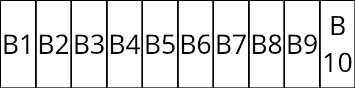
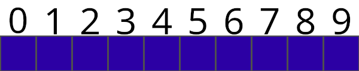

# ESTRUTURA LISTA
Sabe a sua lista de compras, sua lista de amigos, lista de seguidores no TikTok (o famoso TikoTeko) etc. etc. Sabe o eles tem em comum? SÃO TUDO LISTAS!

Para nós, meros humanos, uma lista é algo simples, e de vez em quando bobo. Mas para um computador é algo de fritar os neurônios ~~(ou o processador hahaha)~~. Ele entende blocos isolados, um número que representa uma idade, uma letra que represanta um lugar no estacionamento, um decimal que representa um peso... Tudo isso, o computador pode armazenar em 0's e 1's sem tanta dificuldades. Mas lista são sequências de valores que estão ligadas por algo - para nós, o sentido. 

Quando você faz uma lista de compras, elas se relacionam com as coisas que tu precisas comprar; sua *wishlist* da Steam é de jogos que queres comprar; uma lista de pacientes de transplante, em que as pessoas são relacionadas com aquelas que precisam do transplante; e por assim vai. 

Mas a máquina não entende esse contexto. Não dá para informar para ela que você quer criar uma lista com tais valores e eles estão tudo relacionado por tal coisa!

Então como a máquina faz?? Bem, vamos entender o básico de uma lista em um computador.

Penso em um retângulo gigantesco! (Ou só olhe a imagem abaixo):
\

Este vai ser nosso bloco de memória que iremos usar para montar nossa lista!

Não dá só jogar as informações aí dentro, nesse estado ele só recebe uma informação. Então vamos dividir ele! Abaixo há uma imagem do bloco de memória divido em blocos menores, cada um iniciando com B, em seguida um número para representar sua posição
\

Agora temos dez espaços de memórias que conseguimos jogado até dez informações aí dentro! Podemos colocar uma informação em B1, outra em B2, e assim por diante! Mas, mesmo assim, não temos uma lista real. O que temos agora é vários blocos com informações, mas nenhum deles estão ligados entre si.

Então o próximo passo que o computador faz é armazenar em cada bloco o endereço do próximo da lista. Assim, o B1 tem o endereço do B2, o B2 tem o endereço do B3, e assim continua até B10, que não tem um próximo elemento.

Praticamente assim que funciona uma lista em um computador. Uma variável nunca vai receber essa lista toda, ela só vai receber o endereço do primeiro elemento que, a partir daí, vai estar ligado com os outros elementos.

Agora vamos ilustrar uma lista (ou como é chamado em alguns lugares de vetor ou *array*) como mais ou menos seria em uma linguagem de programação! Olhe a imagem abaixo:

Parecido com o bloco de memória, não? Agora temos um espaço na memória que é dividido em 10 (dez) partes. O que você vê acima desse retângulo é os índices de cada bloco de memória, ou seja, seu "endereço" para nós. Na grande maioria das linguagens, o índice de uma lista inícia em 0. Então, uma lista de 10 elementos, o índice vai de 0 a 9.
