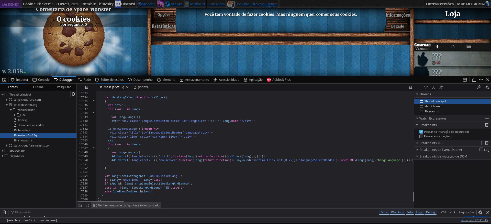

# Modularização
Você sabe seus jogos? Então, eles são muito complexos e tem diversas mecânicas, personagens, dentre outros. Imagina ele ser escrito, todo o código, em um único arquivo!! Ah, mas é tão grande assim? Bem... o Cookie Clicker tem mais de 17 mil (!!!) linhas de códigos!!!! Imagina você ter que mexer nele para atualizar algo, impossível!



Como podemos deixar mais bonitinho? Através das modularização! Que seria separar o seu código em vários arquivos menores.

## Conceito
Imagina você está escrevendo um código gigante! Você pode separar ele em arquivos menores.
```bash
codigo
|- operacoes_aritmetricas
|  |- codigo.py
|- operacoes_geometricas
|  |- codigo.py
|- principal.py
```
Temos esses códigos na pasta `codigo`, em que cada parte do programa é separado em subpastas (`operacoes_geometricas` e `operacoes_aritmetricas`) e no final o `principal.py` vai pegar todos esses códigos e usá-los.

Em Python, temos algumas peculariedades.

## Importação simples
Quando temos mais arquivos, podemos importar funções e variáveis entre eles de maneira mais fácil. Analisamos a árvore:
```bash
codigo
|- somas.py
|- operacoes.py
```

Código do arquivo `somas.py`:

```python
# somas.py
def soma2valores(x,y):
    return x+y

def soma3valroes(x,y,z):
    return x+y+z
```

Para importamos as funções para a `operacoes.py`, podemos usar a palavra chave `import` junto com o nome do arquivo (`somas`).
```python
import somas
```

Para usar as funções (ou variáveis) de `somas` em `operacoes`, escrevemos o nome do arquivo+ponto(".")+função(ou variável).
```python
import somas

print(somas.soma2valores(10,20)) # 30
print(somas.soma3valores(10,20,30)) # 60
```

Mas fica cansativo escrever `soma.`+funcao/variável, imagina só escrever o nome da função. Para isso, temos que escrever que "de um arquivo, importe isto", e usamos o `from`+nome do arquivo+`import`+nome da função/variável.
```py
from somas import soma2valores, soma3valores

print(soma2valores(10,20)) # 30
print(soma3valores(10,20,30)) # 60
```

Caso não queira ficar escrevendo função por função e queira puxar todo o pacote, pode usar o asterisco ("*").
```py
from somas import *

print(soma2valores(10,20)) # 30
print(soma3valores(10,20,30)) # 60
```

## Separar em outras pastas
Mas imagina você começar a criar diversos arquivos, mas aí você percebe e tem mais de mil em uma única pasta! Bem, aumentando nossa organização, podemos colocar em mais de uma pasta

Vamos separar os arquivos em duas pastas: `operacoes` e `impressao`.
```bash
codigo
|- operacoes
|  |- somas.py
|  |- multiplicacoes.py
|- impressao
|  |- imprimir.py
|- main.py # arquivo principal
```

Vamos ver o que tem dentro do aquivo `somas.py`:
```py
# somas.py
def soma2valores(x,y):
    return x+y

def soma3valroes(x,y,z):
    return x+y+z
```

Agora dentro de `multiplicacoes.py`:
```py
# multiplicacoes.py
def mult2valores(x,y):
    return x*y

def mult3valroes(x,y,z):
    return x*y*z
```

Dentro de `imprimir.py`:
```py
# imprimir.py
def msg(mensage):
    print("-"*50)
    print(mensage.center(50))
    print("-"*50)
```

NOSSA! Muitas funções, agora vamos trazer para o `main.py`. Para isso, precisamos indicar onde está este arquivo, um caminho. Aqui, usamos a estrutura: `import pasta.arquivo`, para acessar pastas mais fundas, só adicionar este no caminho: `import pasta1.pasta2.arquivo`.

Vamos usar nossos exemplos já criados:
```py
import operacoes.somas
import operacoes.multiplicacoes
import impressao.imprimir

print(operacoes.somas.soma2valores(10,20)) # 30
print(operacoes.multiplicacoes.mult2valores(10,20)) # 200
impressao.imprimir.msg(str(operacoes.somas.soma2valores(10,20)))
"""
--------------------------------------------------
                        30                        
--------------------------------------------------
"""
```

Vemos que precisamos indicar o caminho completo para a função para usá-las, podemos suar a mesma estratégia de `from`.
```py
from operacoes.somas import *
from operacoes.multiplicacoes import *
from impressao.imprimir import *

print(soma2valores(10,20)) # 30
print(mult2valores(10,20)) # 200
msg(str(soma2valores(10,20)))
"""
--------------------------------------------------
                        30                        
--------------------------------------------------
"""
```

## Fazer um biblioteca própria
Temos um jeito de fazer nossa biblioeteca próprio do Python! Quando criamos uma pasta, podemos criar o arquivo `__init__.py`, indicando para o Python que a pasta é um pacote, e isso nos trás alguns benefícios.

Dentro do `__init__.py`, podemos importar todas as bibliotecas nesse arquivo e não precisamos informar de qual código ele vem.

Vejamos a hierarquia de pastas:
```bash
codigo
|- operacoes # agora temos a biblioteca "operacoes"
|  |- __init__.py
|  |- somas.py
|  |- multiplicacoes.py
|- impressao # agora temos a biblioteca "impressao"
|  |- __init__.py
|  |- imprimir.py
|- main.py # arquivo principal
```

Os arquivos `somas` e `multiplicacoes` ficam inalterável, assim como o `imprimir`. Os *init's* vão ter algo a mais.

**__init__.py de operacoes**
```py
from .somas import *
from .multiplicacoes import *
```

**__init__.py de impressao**
```py
from .imprimir import *
```

Agora no `main.py`, podemos ter dois jeito de importar as biblioteas:
```py
import operacoes
import impressao

print(operacoes.somas.soma2valores(10,20)) # 30
print(operacoes.multiplicacoes.mult2valores(10,20)) # 200
impressao.imprimir.msg(str(operacoes.somas.soma2valores(10,20)))
"""
--------------------------------------------------
                        30                        
--------------------------------------------------
"""
```

Para resumir o que escrever, podemos escrever com o `from`:
```py
from operacoes import *
from impressao import *

print(soma2valores(10,20)) # 30
print(mult2valores(10,20)) # 200
msg(str(soma2valores(10,20)))
"""
--------------------------------------------------
                        30                        
--------------------------------------------------
"""
```

## Bibliotecas externas
Fazer tudo sozinho pode ser muito trabalhoso! Mas incrivelmente há diversos programadores que fizeram várias bibliotecas. Bibliotecas de jogos ou de cálculos matemáticas que o python básico não oferece, demonstrando em alguns casos um desempenho melhor que o próprio Python.

Para conseguimos pegar bibliotecas externas, precisamos criar um ambiente virtual do Python, e podemos ver isso no [Ambiente Virtual](../ambientes-virtuais/). Aqui vamos só abordar como baixar a biblioteca de forma mais rápida e demonstrar como usar.

Primeiro, temos que criar o ambiente virtual! Acessamos o terminal e vamos até a pasta do projeto e digitamos na tela preta:
- `python -m venv venv` ou `python -m venv .venv`
  
Aí vai criar a pasta do ambiente. Em seguida, temos que ativar o ambiente:
- **Windows**: `venv\Scripts\Activate.ps1` (PowerSheel)/ `venv\Scripts\activate.bat` (Prompt)
- **Linux/Mac OS:** `source venv/bin/activate`

Agora podemos baixar as bibliotecas!

Para isso, na pasta onde está o `venv`, podemos digital o comando `pip install <biblioteca>`, aí baixamos a biblioteca que queremos.

Para usar como exemplo, vamos de Numpy, biblioteca relacionado à cálculos matemáticos e manipulação de *arrays*.

Primeiro, temos que baixá-lo. Para isso, temos que ativar o ambiente e, na mesma pasta, podemos usar o `pip install numpy` no terminal.

Agora podemos trazer algumas funções do Numpy, como calcular o seno de um ângulo em radiano.
```py
from numpy import sin, pi

print(sin(2*pi)) # calcula o seno em 2 pi radiano
```

# Conclusão
UFA! Falamos tudo que poderiamos falar sobre o básico de Python.

O Python é uma linguaguem muito grande e com uma comunidade imensa, então pode se aprofudar na linguagem, ou tentar até outra linguagem! Com os conhecimentos que adquiriu aqui, você consegue lidar com qualquer outra linguagem sem muitas dificuldades!

Se quiser se aprofundar em Python, temos nosso curso de dados [curso de dados](../02-stack-dados/), que usamos a linguagem para analisar dados e poder gerar relatórios com eles.